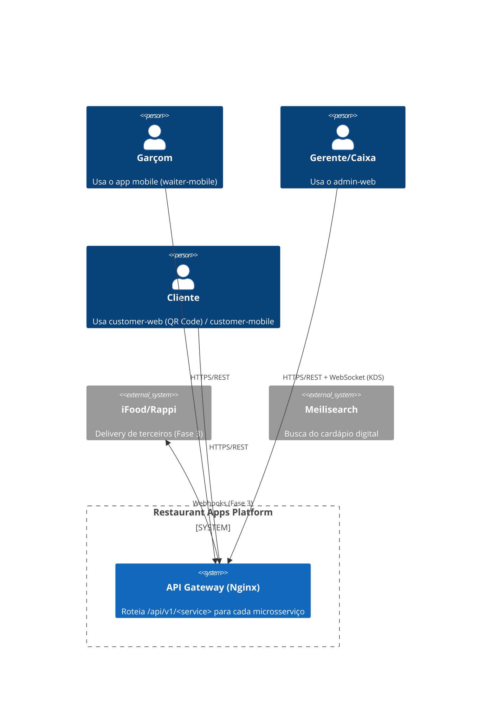
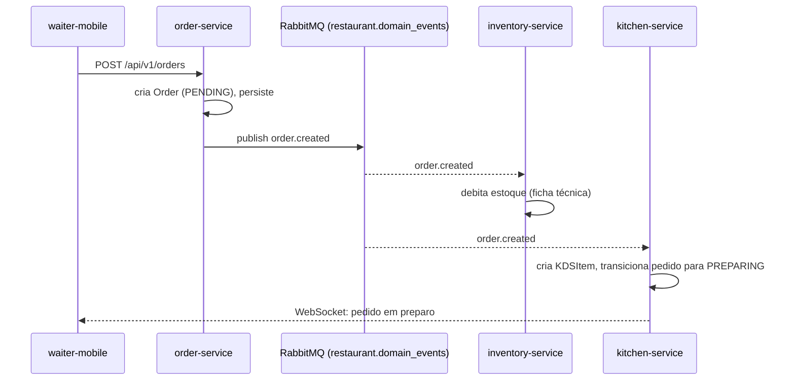

# 🏛️ Visão Detalhada de Arquitetura — Diagramas C4 e Fluxo de Dados

> Complementa [`ARCHITECTURE.md`](../ARCHITECTURE.md). Este documento existe para fechar a
> lacuna apontada na auditoria de 2026-08-04 (link presente no índice do README sem
> conteúdo correspondente) — ver `docs/logs/2026-08-04.md`.

## Nível 1 — Contexto (C4)



## Nível 2 — Containers

Cada retângulo abaixo é um microsserviço independente sob `services/`, com banco
PostgreSQL próprio (Database-per-Service) e pipeline de deploy próprio:

| Container | Responsabilidade | Consumidores diretos |
|---|---|---|
| `auth-service` | Identidade, RBAC/ABAC, PINs, JWT | Todos os demais serviços (validação local do JWT) |
| `restaurant-service` | Tenant, branding, configuração do estabelecimento | `admin-web`, `customer-web` |
| `menu-service` | Cardápio, categorias, produtos, Meilisearch | `admin-web`, `customer-web`, `waiter-mobile` |
| `dining-service` | Mesas, comandas, fila de espera | `waiter-mobile`, `admin-web` |
| `order-service` | Motor de pedidos, orquestração da Saga | `waiter-mobile`, `customer-web`, `kitchen-service` |
| `kitchen-service` | KDS em tempo real (WebSocket) | `admin-web` (painel de cozinha) |
| `inventory-service` | Estoque, ficha técnica, baixa automática | reage a eventos do `order-service` |
| `payment-service` | Caixa, pagamentos, split | `admin-web`, `waiter-mobile` |
| `delivery-service` | Logística de entrega (Fase 3) | `customer-mobile` |
| `marketing-service` | Cupons e fidelidade (Fase 2) | `customer-web`, `customer-mobile` |
| `notification-service` | Disparo de push/e-mail/WhatsApp | consome eventos de todos os serviços |
| `analytics-service` | Auditoria imutável e relatórios (DRE) | `admin-web` |

## Nível 3 — Componentes (padrão interno, todo serviço)

Ver `ARCHITECTURE.md §3` para a árvore de diretórios canônica
(`domain/application/infrastructure/presentation`). Fluxo de uma requisição:

```
Request → presentation/api (router fino, valida DTO)
        → application/use_cases/<Algo>UseCase.execute()
        → application/interfaces/repository_interface.py (contrato)
        → infrastructure/repositories/sqlalchemy_repository.py (implementação)
        → domain (entidades puras, sem I/O)
```

## Fluxo de Dados — Saga por Coreografia (exemplo: novo pedido)



Em caso de falha (ex: estoque insuficiente), `inventory-service` publica
`inventory.deduction_failed`; `order-service` assina esse evento e aplica a
compensação (`Order.transition_to(CANCELLED)`), completando o padrão Saga por
coreografia descrito na `ADR-001-microservices-architecture.md`.

## Isolamento entre serviços

- Nenhum serviço acessa diretamente a tabela de outro (`docs/DATABASE.md`).
- Comunicação síncrona: REST interno autenticado por JWT de serviço.
- Comunicação assíncrona: `packages/events` (`DomainEvent` sobre RabbitMQ topic exchange
  `restaurant.domain_events`).
